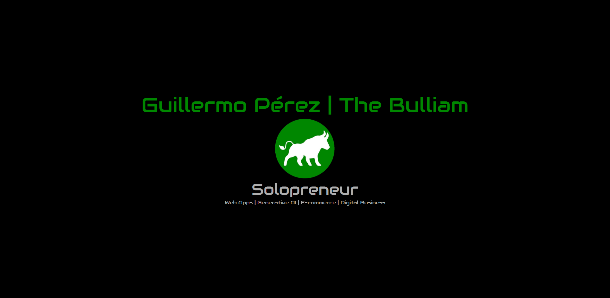

    

## 👋 Hi there, I'm Guillermo Pérez | The Bulliam

### 🚀 About Me
I have always been passionate about technology for as long as I can remember. What started as a hobby has become a profession, learning self-taught and more recently completing my formal training in web development.

From my previous work activities I have learned to be decisive, pay attention to details, analyze and correct mistakes, negotiate, sell, face challenges under pressure and work as a team in an agile and effective way. All this has been of great help to face, with resolution, any challenge in the digital industry.

🤖 I'm currently learning and working with artificial intelligence and Web3 to be prepared for the future

### 🛸 Technologies and 🛠 Tools:

|  ☕ Languages:  |    💻 DevTools:    | 🛸 Dependencies: |    ⚔️ Tools:    |
| ---------------- | ------------------ | ----------------- | --------------- |
| HTML5            | Visual Studio Code | Mongoose          | Slack           |
| CSS3             | Git                | JSON Web Token    | Discord         |
| JavaScript (ES6) | npm                | React Hooks       | Instagram       |
| Bootstrap        | GitHub             | React Router      | Linkedin        |
| MongoDB          | Postman            | jQuery UI         | Twitter         |
| NodeJS           | Google Chrome      | Nodemon           | Notion          |
| React            | Youtube            | Bcryptjs          | Gmail           |
| ExpressJS        | Adobe Photoshop    | Axios             | Google Drive    |
| Handlebars       | Pixabay            | FontAwesome       | Google Calendar |
| JSON             | Figma              | Dotenv            | Office          |
| jQuery           | Netlify            | Nodemailer        | Canva           |
| PHP              | Railway            | Cloudinary        | Habitica        |
| Typescript       | Hostinger          | AOS.js            | ChatGPT         |
| Tailwind         | Generative AI      | Chart.js          | DALL-E 2        |
| OOP              | Platzi             | Api Rest          | Stripe          |

### ☎ Contact me:
- Phone & WhatsApp: +34 616 03 52 00
- Email: guiller.gpf@gmail.com | guillermo@thebulliam.com

### 💻 My Website:
- [The Bulliam](https://thebulliam.com)

### 🎡 Social Media
- [LinkedIn](https://www.linkedin.com/in/guillermo-perez-fuentes/)
- [Twitter](https://twitter.com/thebulliam)
- [Discord](https://discord.com/users/thebulliam)
- [Instagram](https://instagram.com/thebulliam)
- [Spotify playlist](https://open.spotify.com/playlist/3aTK1jwbHit8QSz3UMYXJa?si=42ee46296fd14ba3)