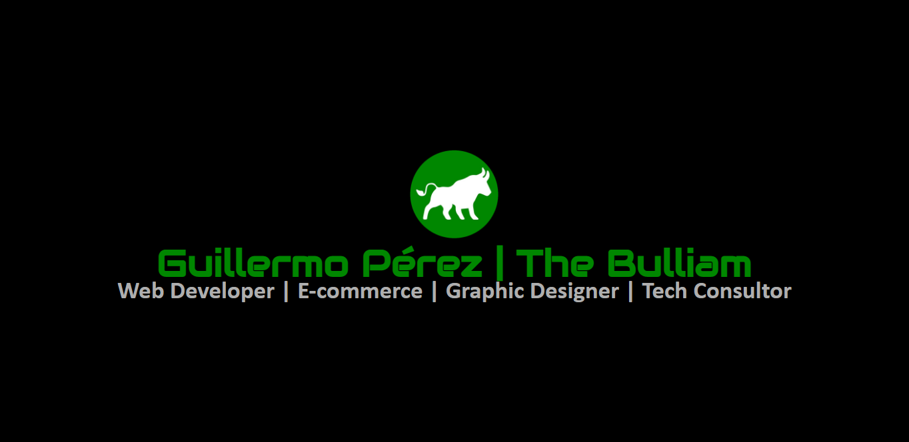

    

## 👋 Hi there, my name is Guillermo Pérez | The Bulliam

### 🚀 About Me
I have been passionate about technology since I can remember. In recent years I have developed my professional activity in the field of air conditioning, and partly also as an entrepreneur. What started as a hobby has become a profession, learning independently and more recently completing my formal training in web development at IronHack Madrid.

From my previous work activities I have learned to be decisive, pay attention to details, analyze and correct mistakes, negotiate, sell, face challenges under pressure and work as a team in an agile and effective way. All this has been a great help to face the intensive training I have done and I think it can help me to face any challenge resolutely in the digital industry.

🎮 I also create videogames in Canvas with javaScript (object oriented programming)

### 🛸 Technologies and 🛠 Tools:

| 🛸Technologies:  |    🛠 Tools:       |
| ---------------- | ------------------ |
| HTML5            | Visual Studio Code |
| CSS3             | Git                |
| JavaScript (ES6) | npm                |
| Bootstrap        | GitHub             |
| MongoDB          | Slack              |
| NodeJS           | Discord            |
| React            | Instagram          |
| ExpressJS        | Linkedin           |
| Mongoose         | Notion             |
| JSON             | Calendly           |
| JSON Web Token   | Postman            |
| React Hooks      | Gmail              |
| React Router     | Google Chrome      |
| jQuery           | Google Drive       |
| PHP              | Google Calendar    |
| Typescript       | Firefox            |
| Tailwind         | Youtube            |
| OOP              | Adobe Photoshop    |
| Bcryptjs         | Office             |
| Axios            | Canva              |
| Fontawesome      | Figma              |
| Dotenv           | Netlify            |
| Nodemailer       | Heroku             |
| Cloudinary       | Habitica           |
|                  | Hostinger          |
|                  | PayPal             |

### ☎ Contact me:
- Phone & WhatsApp: +34 616 03 52 00
- Email: guiller.gpf@gmail.com | guillermo@thebulliam.com
- [Calendly](https://calendly.com/guiller-gpf)

### 📘 My Portfolio:
- [The Bulliam](https://thebulliam.com)

### 🎡 Social Media
- [LinkedIn](https://www.linkedin.com/in/guillermo-perez-fuentes/)
- [Discord](https://discord.com/users/thebulliam#2993)
- [Instagram](https://instagram.com/thebulliam)
- [Spotify playlist](https://open.spotify.com/playlist/3aTK1jwbHit8QSz3UMYXJa?si=42ee46296fd14ba3)

### 📜 Docs

    
    

